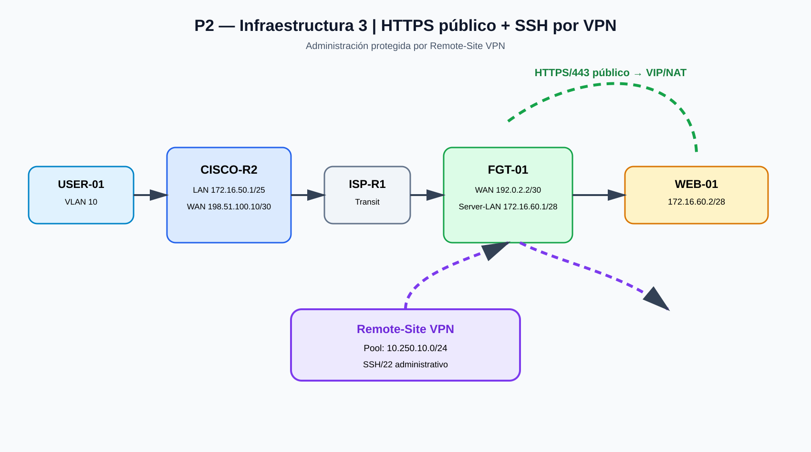

# Infraestructura 3 — HTTPS público y SSH protegido mediante VPN

**Video:** https://youtu.be/zlPV4KATfC4

## 1. Objetivo

Construir un escenario donde el servicio HTTPS del servidor sea accesible públicamente, mientras que el acceso administrativo SSH quede restringido y se permita únicamente a través de la Remote-Site VPN.

## 2. Topología

## 3. Direccionamiento

| Equipo / segmento | Dirección | Función |
|---|---|---|
| USER-01 / VLAN 10 | 172.16.50.0/25 | Red de usuarios |
| CISCO-R2 LAN | 172.16.50.1/25 | Gateway |
| CISCO-R2 WAN | 198.51.100.10/30 | Enlace hacia ISP |
| ISP-R1 | 198.51.100.9/30 | Tránsito |
| ISP-R1 / tránsito | 192.0.2.1/30 | Enlace hacia FGT-01 |
| FGT-01 WAN | 192.0.2.2/30 | Interfaz pública |
| FGT-01 Server-LAN | 172.16.60.1/28 | Gateway de servidores |
| WEB-01 | 172.16.60.2/28 | Servidor web/SSH |
| Remote-Site VPN | 10.250.10.0/24 | Origen permitido para SSH |

## 4. Comportamiento de seguridad

### HTTPS

HTTPS/443 se publica mediante VIP/NAT hacia WEB-01 y permanece disponible desde el exterior.

### SSH

TCP/22 no debe quedar expuesto directamente desde WAN. El acceso administrativo se reserva para tráfico originado desde 10.250.10.0/24 a través de la Remote-Site VPN.

## 5. VLAN y DHCP

La red de usuarios utiliza VLAN 10 con 172.16.50.0/25. El diseño incorpora DHCP para los clientes.

## 6. Routing y NAT

El escenario requiere routing entre LAN, ISP y FGT-01, NAT/VIP para HTTPS y políticas diferenciadas para HTTPS y SSH.

## 7. Matriz de políticas

| Servicio | Origen | Destino | Resultado |
|---|---|---|---|
| HTTPS / 443 | Red externa | VIP → WEB-01 | Permitido |
| SSH / 22 | WAN general | WEB-01 | Denegado |
| SSH / 22 | 10.250.10.0/24 por VPN | WEB-01 | Permitido |

## 8. WEB-01

~~~text
IP:      172.16.60.2/28
Gateway: 172.16.60.1
~~~

## 9. Validaciones

La demostración se organiza alrededor de DHCP en VLAN 10, conectividad IP, traceroute, HTTPS sin VPN, restricción de SSH desde WAN, establecimiento de Remote-Site VPN y acceso administrativo por SSH mediante VPN.

## 10. Resultado

La infraestructura separa dos superficies:

- **Servicio público:** HTTPS/443.
- **Administración privada:** SSH/22 mediante VPN.

Esto mantiene el servicio web publicado sin exponer directamente el servicio administrativo.
